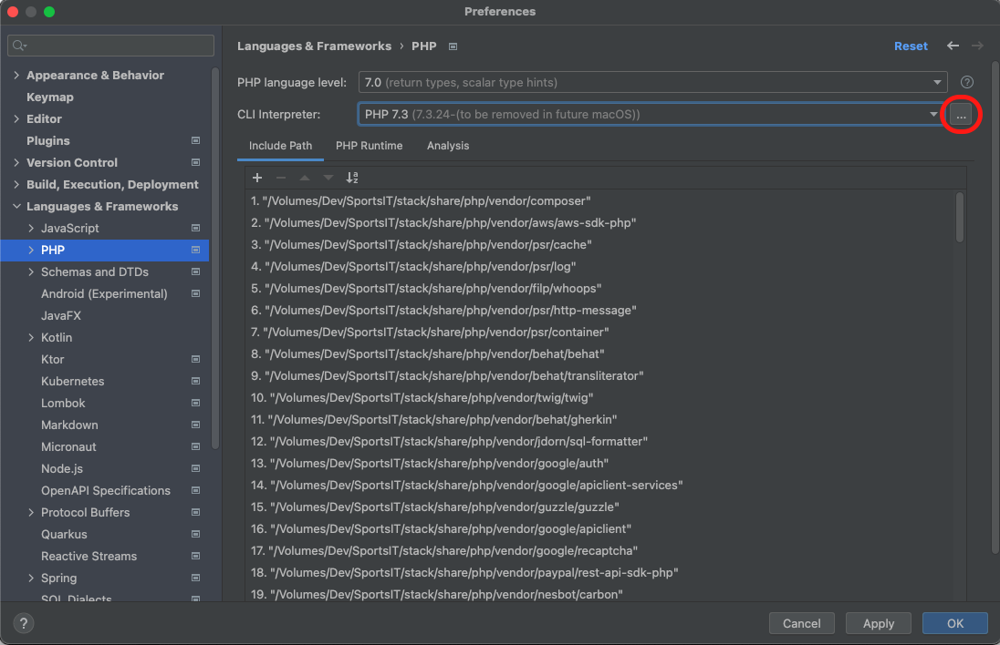
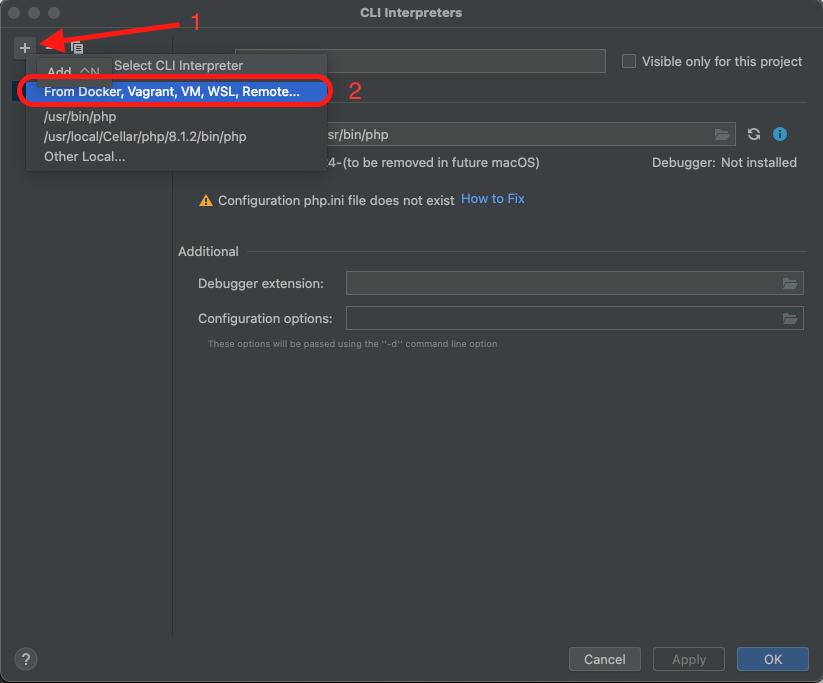
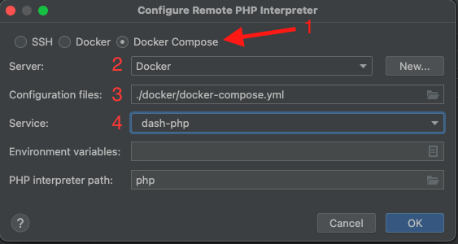
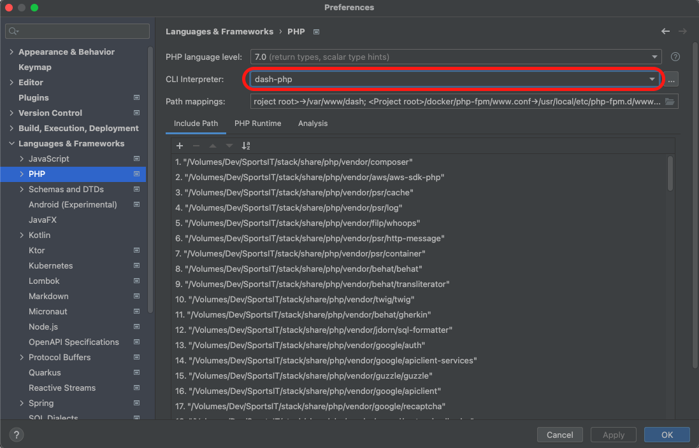
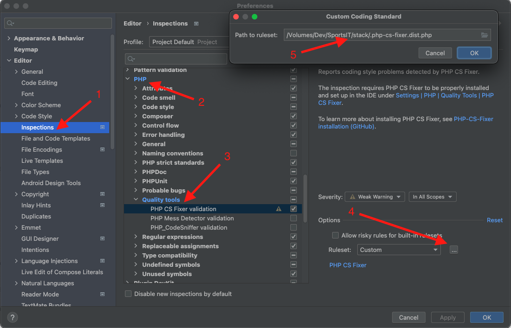
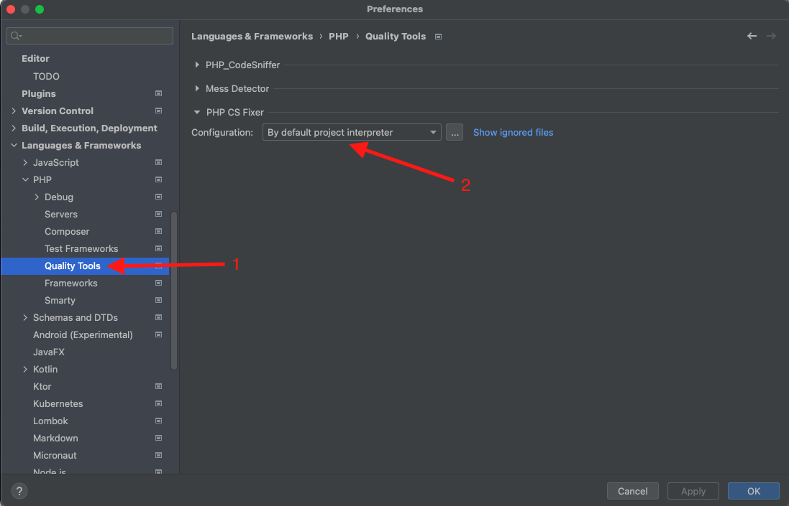
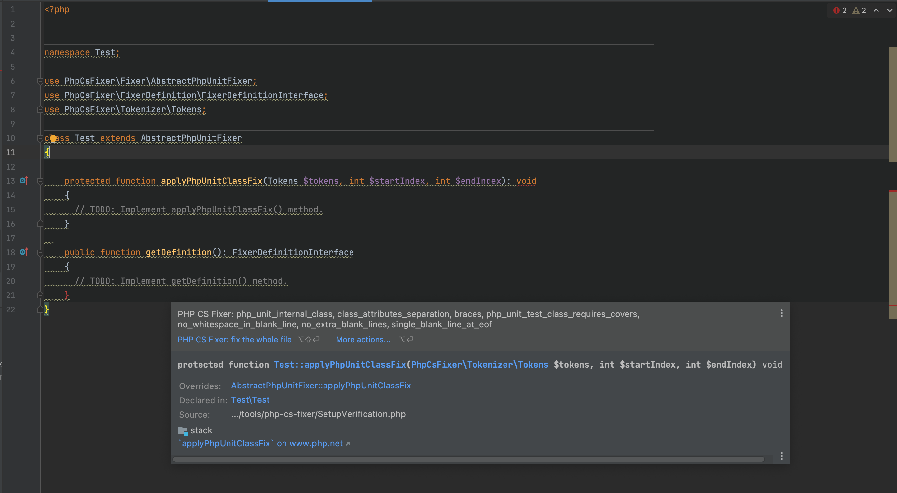

## IntelliJ Setup
To enable the IntelliJ Integration, we must first enable that you have the following plugins installed:
1. PHP - Interprets PHP files and provides helpful hints.
2. PHP Remote Interpreter - Enables the IDE to run PHP code using interpreters that are not on the host machine.
3. PHP Docker - Enables running PHP code via Docker containers.

After the plugins have been installed and enabled, restart your IDE to make sure they are recognized. Next,

### Create New PHP Interpreter
Go to the PHP settings in IntelliJ's Preferences and click the three dots net to the CLI Interpreter input as shown below.

In the modal that opens, click the `+` button to create a new interpreter (1) and click the `From Docker...` option (2).

Another modal should open, and you should select the `Docker Compose` option (1), the `Server` should be the Docker daemon running on your machine (2), the path to the Docker Compose configuration file (3), and the service to use for running PHP (4).

Finally, select the new interpreter as the default for the project.

### Configure Inspection
To enable IntelliJ's inspection for PHP-CS-Fixer, go to `Editor` -> `Inspections`(1) -> `PHP` (2) -> `Quality Tools` (3), select a `Custom` Ruleset and click the `...` button. In the modal that appears, enter the path to the `php-cs-fixer.dist.php` file (5).

Next, go to `Languages & Frameworks` -> `PHP` -> `Quality Tools` (1) and select `By default project interpreter` for the `Configuration`.

### Verify Setup
Go to [SetupVerification.php](SetupVerification.php) and verify that the inspection creates a hint like shown below.

